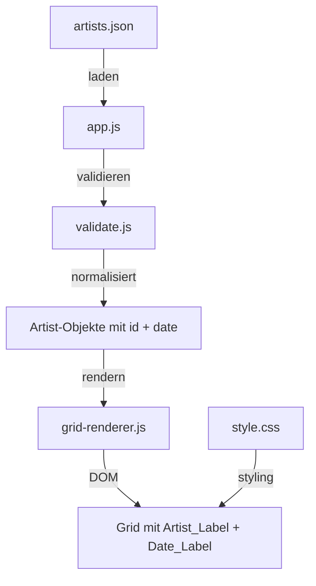

# Design Document: Artist Date Display

## Overview

Diese Erweiterung fügt ein optionales `date`-Feld zum Datenmodell der `artists.json` hinzu und zeigt dieses Datum im Grid unterhalb des Künstlernamens an. Die Implementierung umfasst drei Hauptbereiche:

1. **Validator-Erweiterung** (`validate.js`): Akzeptiert sowohl das bestehende String-Format als auch das neue Objekt-Format mit `id` und optionalem `date`-Feld.
2. **Grid-Renderer-Erweiterung** (`grid-renderer.js`): Erzeugt ein zusätzliches `span.date-label`-Element, wenn ein Datum vorhanden ist.
3. **CSS-Styling** (`style.css`): Dezentes Styling des Datums-Labels mit kleinerer Schrift, geringerem Kontrast und Overflow-Handling.

Die Rückwärtskompatibilität bleibt vollständig gewahrt – bestehende Konfigurationen mit reinen ID-Strings funktionieren weiterhin ohne Anpassung.

## Architecture



### Architektur-Entscheidungen

1. **Normalisierung im Validator**: Der Validator wandelt alle Einträge in ein einheitliches `{id, date?}`-Format um, sodass nachgelagerte Module nur noch ein Format verarbeiten müssen.
2. **Optionales DOM-Element**: Das Date_Label wird nur erzeugt, wenn ein Datum vorhanden ist – kein leeres Element bei fehlenden Daten.
3. **Freitext-Datum**: Das `date`-Feld ist ein freier String (max. 20 Zeichen), kein erzwungenes Datumsformat. Dies ermöglicht flexible Angaben wie "15.03.2025", "März 2025" oder "Sommer '25".

## Components and Interfaces

### validate.js – `validateArtistIds(input)`

**Bestehende Signatur bleibt erhalten**, das Rückgabeverhalten wird erweitert:

```javascript
/**
 * Validiert die Artist-Konfiguration.
 *
 * @param {*} input - Die zu validierende Eingabe
 * @returns {Array<{id: string, date?: string}> | {valid: false, error: string}}
 *   Bei Erfolg: normalisiertes Array von Artist-Objekten
 *   Bei Fehler: Objekt mit valid=false und Fehlermeldung
 */
export function validateArtistIds(input) { ... }
```

**Validierungslogik:**
1. Prüfe, ob `input` ein Array ist
2. Prüfe Länge: 20–40 Einträge
3. Für jeden Eintrag:
   - String (nicht-leer): gültig → normalisieren zu `{id: entry}`
   - Objekt mit `id` (nicht-leerer String): gültig
     - Falls `date` vorhanden: muss String sein, 1–20 Zeichen
   - Sonst: ungültig → Fehlermeldung mit Eintrag-Index

### grid-renderer.js – `GridRenderer.render(artists)`

**Erweiterung der `render`-Methode:**

```javascript
/**
 * Rendert alle Künstler als Grid-Elemente.
 * @param {Array<{id: string, name: string, imageUrl: string|null, date?: string}>} artists
 */
render(artists) {
  // ... bestehende Logik ...
  
  // Nach dem artist-label:
  if (artist.date) {
    const dateLabel = document.createElement('span');
    dateLabel.classList.add('date-label');
    dateLabel.textContent = artist.date;
    gridItem.appendChild(dateLabel);
  }
}
```

### style.css – `.date-label`

```css
.date-label {
  display: block;
  font-size: 0.7rem;          /* ≈82% von 0.85rem (artist-label) */
  color: #999;                 /* geringerer Kontrast als #e0e0e0 */
  text-align: center;
  white-space: nowrap;
  overflow: hidden;
  text-overflow: ellipsis;
  margin-top: 2px;            /* ≤ 4px Abstand */
}
```

### app.js – Datenfluss-Anpassung

Die `app.js` muss die normalisierten Objekte aus dem Validator an die Spotify-API und den Grid-Renderer weitergeben. Das `date`-Feld wird durch den API-Fetch-Prozess durchgeschleust und dem Renderer-Input hinzugefügt.

## Data Models

### Artist_Config (artists.json)

```typescript
// Neues Format (Objekt-Einträge)
type ArtistEntry = {
  id: string;       // Spotify Artist ID, nicht-leer
  date?: string;    // Optional, 1–20 Zeichen
}

// Rückwärtskompatibles Format
type ArtistConfig = Array<string | ArtistEntry>;
```

**Beispiel:**
```json
[
  "0TnOYISbd1XYRBk9myaseg",
  { "id": "6eUKZXaKkcviH0Ku9w2n3V", "date": "15.03.2025" },
  { "id": "1Xyo4u8uXC1ZmMpatF05PJ" },
  "6qqNVTkY8uBg9cP3Jd7DAH"
]
```

### Normalisiertes Artist-Objekt (nach Validierung)

```typescript
type NormalizedArtist = {
  id: string;
  date?: string;
}
```

### Renderer-Input (nach API-Fetch)

```typescript
type RendererArtist = {
  id: string;
  name: string;
  imageUrl: string | null;
  date?: string;
}
```

## Correctness Properties

*A property is a characteristic or behavior that should hold true across all valid executions of a system—essentially, a formal statement about what the system should do. Properties serve as the bridge between human-readable specifications and machine-verifiable correctness guarantees.*

### Property 1: Gültige Konfigurationen werden akzeptiert

*For any* Array mit 20–40 Einträgen, wobei jeder Eintrag entweder ein nicht-leerer String oder ein Objekt mit nicht-leerem `id`-String und optionalem `date`-String (1–20 Zeichen) ist, soll der Validator das Array akzeptieren und ein normalisiertes Array von Objekten mit `id` (und optionalem `date`) zurückgeben.

**Validates: Requirements 1.1, 1.2, 1.3, 2.1, 2.2**

### Property 2: Ungültige Einträge werden abgelehnt

*For any* Array mit 20–40 Einträgen, das mindestens einen ungültigen Eintrag enthält (Eintrag ist weder nicht-leerer String noch Objekt mit gültigem `id`; oder Objekt hat `date` das kein String ist, leer ist, oder >20 Zeichen hat), soll der Validator ein Fehlerobjekt `{valid: false, error: string}` zurückgeben, dessen Fehlermeldung den fehlerhaften Eintrag identifiziert.

**Validates: Requirements 1.4, 1.5, 2.4**

### Property 3: Längeneinschränkung wird durchgesetzt

*For any* Array von ausschließlich gültigen Einträgen, dessen Länge außerhalb des Bereichs 20–40 liegt, soll der Validator ein Fehlerobjekt zurückgeben.

**Validates: Requirements 2.3**

### Property 4: Date_Label DOM-Struktur

*For any* gerenderter Künstler mit einem `date`-Feld soll das zugehörige Grid-Item ein `span.date-label`-Element enthalten, das ein eigenständiges DOM-Element nach dem `span.artist-label` ist; und für jeden Künstler ohne `date`-Feld (oder mit `undefined`/`null`) soll kein `span.date-label`-Element existieren.

**Validates: Requirements 3.1, 3.2, 3.4**

### Property 5: Date_Label Inhaltsbewahrung (Round-Trip)

*For any* gültigen Datums-String (1–20 Zeichen), wenn ein Künstler mit diesem Datum gerendert wird, soll das `textContent` des `span.date-label`-Elements exakt dem ursprünglichen Datums-String entsprechen.

**Validates: Requirements 3.3**

## Error Handling

### Validator-Fehler

| Fehlersituation | Fehlermeldung-Muster |
|---|---|
| Eingabe kein Array | "Die Datei muss ein JSON-Array enthalten." |
| Länge < 20 oder > 40 | "Die Datei muss zwischen 20 und 40 Einträge enthalten." |
| Eintrag ist weder String noch gültiges Objekt | "Eintrag an Position {index} ist ungültig: erwartet nicht-leerer String oder Objekt mit 'id'-Feld." |
| Objekt mit ungültigem `id` | "Eintrag an Position {index}: 'id' muss ein nicht-leerer String sein." |
| Objekt mit ungültigem `date` | "Eintrag an Position {index}: 'date' muss ein String mit 1–20 Zeichen sein." |

### Grid-Renderer

- Kein `date`-Feld → kein Date_Label-Element erzeugt (kein Fehler)
- `date` ist `null` oder `undefined` → behandelt wie "kein date" (kein Fehler)
- Langer Text im Date_Label → CSS text-overflow: ellipsis greift

### App-Level

- Validierungsfehler werden im `#error-container` als `.error-message` angezeigt
- Bestehendes Fehlerhandling bleibt unverändert

## Testing Strategy

### Property-Based Tests (fast-check)

Die Korrektheitseigenschaften werden mit **fast-check** (bereits als Dependency vorhanden) implementiert. Jeder Property-Test führt mindestens 100 Iterationen durch.

| Property | Testdatei | Fokus |
|---|---|---|
| Property 1 | `tests/validate-config-valid.property.test.js` | Gültige gemischte Konfigurationen |
| Property 2 | `tests/validate-config-invalid.property.test.js` | Ungültige Einträge mit Fehlermeldungen |
| Property 3 | `tests/validate-config-length.property.test.js` | Array-Längeneinschränkung |
| Property 4 | `tests/date-label-structure.property.test.js` | DOM-Struktur des Date_Labels |
| Property 5 | `tests/date-label-content.property.test.js` | Inhaltsbewahrung (Round-Trip) |

**Konfiguration:**
- Minimum 100 Iterationen (`{ numRuns: 100 }`)
- Jeder Test referenziert die zugehörige Design-Property im Kommentar
- Tag-Format: `Feature: artist-date-display, Property {N}: {Titel}`

### Unit Tests (Example-Based)

| Bereich | Testdatei | Fälle |
|---|---|---|
| Validator | `tests/validate.test.js` (erweitern) | Spezifische Beispiele für String/Objekt/Mixed-Format |
| Grid-Renderer | `tests/grid-renderer.test.js` (erweitern) | Date_Label-Erzeugung, fehlende Dates |
| CSS-Styling | `tests/grid-renderer.test.js` (erweitern) | CSS-Klassen korrekt gesetzt |

### CSS-Anforderungen (Requirement 4)

Die Styling-Anforderungen (4.1–4.5) werden durch:
- **CSS-Inspection-Tests**: Prüfen, dass die `.date-label`-Klasse mit den korrekten CSS-Eigenschaften definiert ist
- **Manuelle visuelle Prüfung**: Für die subjektiven Aspekte (Hierarchie-Wahrnehmung, Dezenz)

### Testabdeckung

- **Property-Tests**: Universelle Korrektheit der Validierung und DOM-Generierung
- **Unit-Tests**: Spezifische Beispiele, Edge Cases, Integration
- **Bestehende Tests**: Rückwärtskompatibilität sicherstellen – bestehende Property-Tests (`validate-valid.property.test.js`, `validate-invalid.property.test.js`) müssen weiterhin bestehen
