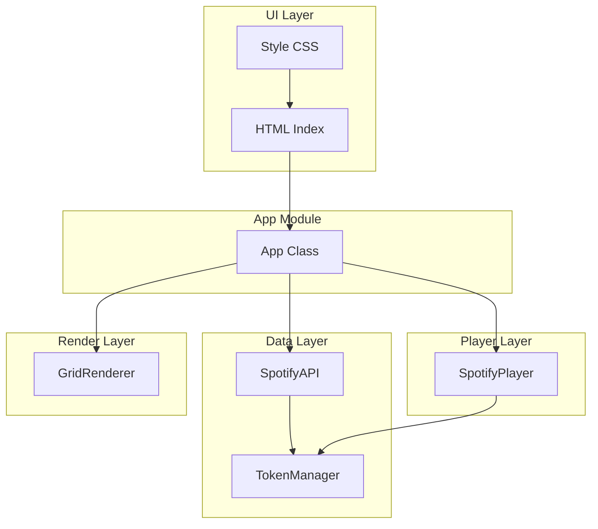
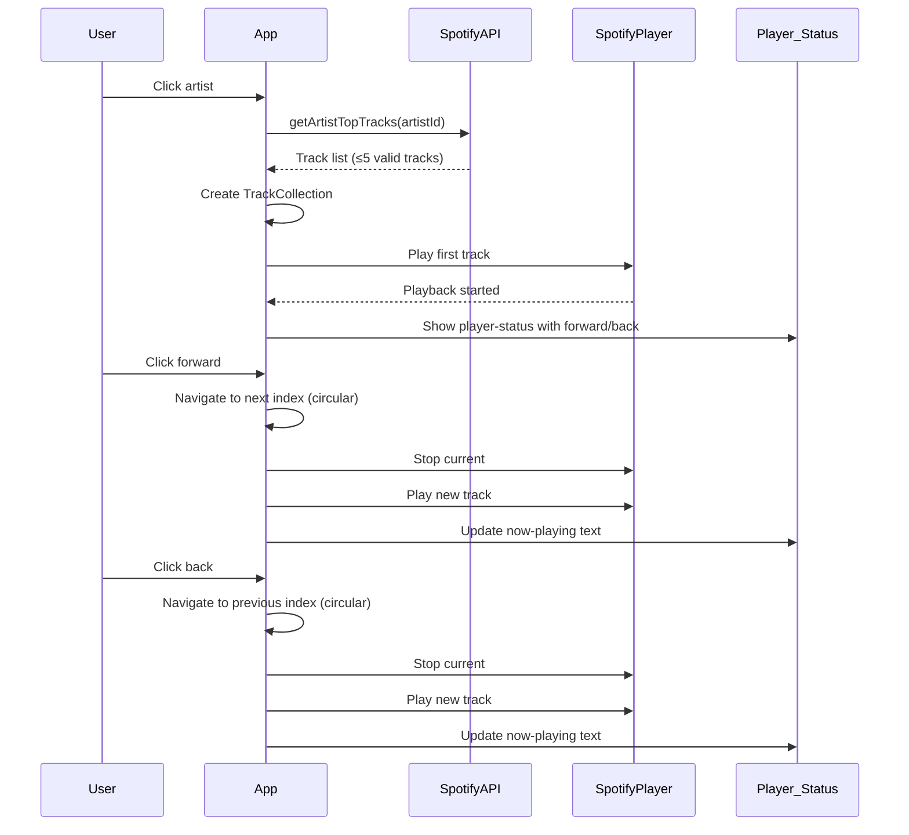

# Design Document: artist-track-navigation

## Overview

The artist-track-navigation feature extends the existing SpotiGrid application to provide five tracks per artist with forward/back navigation controls. The existing `#player-status` area is expanded to include navigation buttons, enlarged for better readability, and fixed to remain visible while scrolling.

### Key Design Decisions

| Decision | Rationale |
|----------|-----------|
| Circular navigation | Requirements specify wrap-around behavior (last→first, first→last) |
| Track collection limit of 5 | Requirements explicitly specify max 5 tracks |
| Mock-based testing for Spotify API | PBT validates app logic; external service behavior verified via integration tests |
| Single TrackCollection per artist | Maintains simplicity; collection is created on artist click |

---

## Architecture

### High-Level Architecture



### Track Navigation Flow



---

## Components and Interfaces

### New Components

1. **TrackCollection** - Data structure holding up to 5 valid tracks for an artist
2. **TrackNavigation** - Logic for circular navigation within a TrackCollection
3. **NavigationControls** - Forward and Back buttons in the player-status area

### Extended Components

| Component | Existing Responsibility | New Responsibility |
|-----------|------------------------|-------------------|
| App | Artist click handling | Track collection management, navigation coordination |
| SpotifyAPI | Single track lookup | Fetch multiple tracks per artist |
| SpotifyPlayer | Single track playback | Track transition handling |
| GridRenderer | Artist display | Mark unplayable artists |

### Class/Module Design

#### TrackCollection

```javascript
/**
 * @typedef {Object} ValidTrack
 * @property {string} uri - Spotify track URI
 * @property {string} name - Track title
 */

/**
 * Manages a collection of valid tracks for an artist.
 * Maximum 5 tracks, ordered as received from Spotify.
 */
class TrackCollection {
  /**
   * @param {ValidTrack[]} tracks - Array of valid tracks
   * @param {number} maxSize - Maximum collection size (default: 5)
   */
  constructor(tracks, maxSize = 5);
  
  /** @returns {ValidTrack[]} - All tracks in collection */
  getTracks();
  
  /** @returns {number} - Number of tracks */
  getCount();
  
  /** @returns {boolean} - Whether collection has valid navigation */
  isNavigable();
  
  /** @returns {ValidTrack|null} - Track at index, or null */
  getTrackAt(index);
}
```

#### TrackNavigation

```javascript
/**
 * Handles circular navigation within a TrackCollection.
 */
class TrackNavigation {
  /**
   * @param {TrackCollection} collection
   */
  constructor(collection);
  
  /** @returns {number} - Current track index */
  getCurrentIndex();
  
  /** @returns {ValidTrack|null} - Current track or null */
  getCurrentTrack();
  
  /**
   * Navigate to next track (circular).
   * @returns {ValidTrack} - The new current track
   */
  forward();
  
  /**
   * Navigate to previous track (circular).
   * @returns {ValidTrack} - The new current track
   */
  back();
  
  /** @returns {boolean} - Whether navigation is possible */
  canNavigate();
}
```

#### SpotifyAPI Extension

```javascript
class SpotifyAPI {
  /**
   * Fetches top tracks for an artist from Spotify.
   * Filters to only valid tracks (non-empty name, valid URI).
   * Limits result to maxSize tracks.
   * 
   * @param {string} artistId - Spotify artist ID
   * @param {number} maxSize - Maximum tracks to return (default: 5)
   * @returns {Promise<ValidTrack[]>}
   */
  async getArtistTopTracks(artistId, maxSize = 5);
}
```

---

## Data Models

### ValidTrack

```typescript
interface ValidTrack {
  uri: string;      // Spotify track URI (e.g., "spotify:track:xxx")
  name: string;     // Non-empty track title
}
```

### ArtistData (Extended)

```typescript
interface ArtistData {
  id: string;
  name: string;
  imageUrl: string | null;
  date?: string;
  // New fields
  trackCollection?: TrackCollection;
  isPlayable?: boolean;
}
```

### PlayerState

```typescript
interface PlayerState {
  isPlaying: boolean;
  artistId: string | null;
  trackIndex: number;
}
```

---

## UI/UX Design

### Player Status Area

```html
<div id="player-status" class="player-status" hidden>
  <span id="now-playing">♪ Artist Name – Track Title</span>
  <div class="navigation-controls">
    <button id="back-control" aria-label="Zum vorherigen Track">
      <svg>...</svg>
    </button>
    <button id="forward-control" aria-label="Zum nächsten Track">
      <svg>...</svg>
    </button>
  </div>
</div>
```

### CSS Structure

```css
/* Fixed positioning - stays visible while scrolling */
.player-status {
  position: fixed;
  top: 0;
  left: 0;
  right: 0;
  z-index: 1000;
  /* Scaled dimensions (1.2x baseline) */
  padding: calc(12px * 1.2);
  font-size: calc(1rem * 1.2);
}

/* Responsive: full width on narrow viewports */
@media (max-width: 599px) {
  .player-status {
    padding: 10px;
    font-size: 0.9rem;
  }
  
  .navigation-controls button {
    width: 40px;
    height: 40px;
  }
}

/* Navigation controls styling */
.navigation-controls {
  display: inline-flex;
  gap: 8px;
  margin-left: 16px;
}

.navigation-controls button {
  background: #282828;
  border: none;
  border-radius: 50%;
  width: calc(36px * 1.2);
  height: calc(36px * 1.2);
  cursor: pointer;
  display: flex;
  align-items: center;
  justify-content: center;
}

.navigation-controls button:disabled {
  opacity: 0.3;
  cursor: default;
}

.navigation-controls button:not(:disabled):hover {
  background: #383838;
}
```

---

## Correctness Properties

This section defines formal correctness properties derived from the acceptance criteria. These properties are suitable for property-based testing with mocked Spotify data and player.

### Property 1: Track-Collection-Grenze (AC 1.2–1.4)

*For any* list of track candidates from Spotify, the normalized TrackCollection SHALL contain at most five distinct tracks, and when at least five valid candidates exist, exactly five tracks; the order of selected tracks is preserved.

**Validates: Requirements 1.2, 1.3, 1.4**

### Property 2: Navigation as Circular Permutation (AC 3.1–3.4)

*For any* TrackCollection with at least two tracks:
- `forward(back(index)) = index`
- `back(forward(index)) = index`
- Repeating forward N times (where N = collection length) returns to the starting index

**Validates: Requirements 3.1, 3.2, 3.3, 3.4**

### Property 3: Display Follows Selection (AC 2.4, 3.6)

*For any* valid artist and track sequence, after each selection the Now_Playing element SHALL contain exactly the active artist's name and the selected track's title; the displayed title is never the title of a different index.

**Validates: Requirements 2.4, 3.6**

### Property 4: Single Active Playback (AC 2.3, 3.5)

*For any* sequence of artist start, forward navigation, backward navigation, and artist change, the previous track SHALL be stopped before starting a new track; the mocked player has at most one active track after each transition.

**Validates: Requirements 2.3, 3.5**

### Property 5: Status Consistency (AC 2.4–2.6, 4.1, 4.7)

*For every* simulated playback state:
- Active_Playback means visible player_status with exactly one forward and one back control
- Inactive state means hidden player_status and empty Now_Playing content

**Validates: Requirements 2.4, 2.5, 2.6, 4.1, 4.7**

### Property 6: Limited Track Lists (AC 3.7–3.8, 4.6)

*For any* TrackCollection with zero or one track, both navigation elements SHALL be disabled (or not visible for zero tracks); *for any* TrackCollection with at least two tracks, both directions are enabled.

**Validates: Requirements 3.7, 3.8, 4.6**

### Property 7: Reset Idempotency (AC 2.6, 6.4)

Executing stop or successful logout once or twice leads to the same state: no Active_Playback, hidden player_status, and empty Now_Playing content.

**Validates: Requirements 2.6, 6.4**

---

## Error Handling

### Error Scenarios

| Scenario | User-Facing Behavior | Technical Action |
|----------|---------------------|------------------|
| Spotify API fails to load tracks | Error message in error container, artist marked as not playable | End Active_Playback if running, mark artist unplayable |
| Player cannot start selected track | Error message in error container | Treat playback as inactive, hide player_status |
| Logout cleanup fails | Error message, retain current playback state | Leave state unchanged, show error |
| Auth becomes invalid during navigation | Immediate re-authentication request | Trigger re-auth flow |

### Error Message Display

```javascript
showError(message) {
  const errorContainer = document.getElementById('error-container');
  if (!errorContainer) return;

  errorContainer.innerHTML = '';
  const errorDiv = document.createElement('div');
  errorDiv.classList.add('error-message');
  errorDiv.textContent = message;
  errorContainer.appendChild(errorDiv);
}
```

---

## Testing Strategy

### Testing Approach

This feature uses a dual testing approach:

**Property-Based Testing** (for internal logic):
- TrackCollection creation and limiting
- Circular navigation logic
- State consistency between playback and UI
- Reset idempotency

**Example-Based Testing** (for specific scenarios):
- UI rendering with specific track counts
- Edge cases (0, 1, 2, 5 tracks)
- Error display scenarios

### Property Test Configuration

Using a PBT library (e.g., fast-check), each property test runs with minimum 100 iterations:

```javascript
// Example property test structure
/**
 * @property Track-Collection-Grenze
 * Feature: artist-track-navigation, Property 1: Track collection limit
 */
fc.assert(fc.property(fc.array(validTrackGen(), { minLength: 0, maxLength: 20 }), (tracks) => {
  const collection = new TrackCollection(tracks, 5);
  
  // At most 5 tracks
  fc.assert(collection.getCount() <= 5);
  
  // If 5+ valid, exactly 5
  const validCount = tracks.filter(t => isValidTrack(t)).length;
  if (validCount >= 5) {
    fc.assert(collection.getCount() === 5);
  }
}), { numRuns: 100 });
```

### Integration Testing

- Spotify API integration tests with mocked responses (1-3 examples)
- End-to-end flow tests with mocked player
- Viewport-responsive layout tests

### Unit Testing Balance

- Focus unit tests on: specific examples, edge cases, error conditions
- Property tests handle: universal properties across all inputs
- Avoid redundant coverage between unit and property tests

---

## Acceptance Criteria Traceability

| Requirement | Design Element | Test Coverage |
|-------------|----------------|---------------|
| 1.1 | SpotifyAPI.getArtistTopTracks | Property 1 |
| 1.2–1.4 | TrackCollection creation | Property 1 |
| 1.5 | Artist markUnplayable | Example test |
| 2.1 | TrackNavigation initialization | Property 3, 5 |
| 2.2 | Error handling in handleArtistClick | Example test |
| 2.3 | Player.play flow | Property 4 |
| 2.4–2.6 | UI display updates | Property 3, 5 |
| 3.1–3.4 | TrackNavigation forward/back | Property 2 |
| 3.5 | Player transition | Property 4 |
| 3.6 | Now_Playing update | Property 3 |
| 3.7–3.8 | Button enable/disable logic | Property 6 |
| 4.1 | Player-status structure | Example test |
| 4.2–4.3 | Duplicate control prevention | Property 5 |
| 4.4–4.5 | Accessible labels | Example test |
| 4.6 | Unplayable artist handling | Property 6 |
| 4.7 | Playback end handling | Property 5, 7 |
| 5.1 | Fixed positioning CSS | Visual/snapshot test |
| 5.2 | Status_Skalierung (1.2x) | CSS/snapshot test |
| 5.3 | Button usability | Example test |
| 5.4 | Responsive CSS | Example test |
| 6.1–6.2 | API error handling | Example test |
| 6.3 | Player error handling | Example test |
| 6.4 | Logout cleanup | Property 7 |
| 6.5 | Logout failure handling | Example test |
| 6.6 | Existing features unchanged | Integration test |
| 6.7 | Auth refresh | Example test |