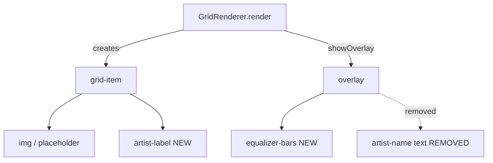

# Design Document: Grid UI Enhancements

## Overview

This feature adds two visual improvements to the SpotiGrid artist grid:

1. **Permanent artist name label** — A text label displayed below each grid image so users can identify artists without triggering playback.
2. **Animated equalizer overlay** — During playback, the overlay replaces the current artist-name text with animated vertical bars (equalizer visualization) in Spotify green.

The changes are scoped to `grid-renderer.js` (DOM structure) and `style.css` (layout, animations). No new modules or external dependencies are introduced.

## Architecture

The enhancement modifies two layers of the existing architecture:



**Key architectural decisions:**

1. **Grid-item restructuring**: The `grid-item` container gains a permanent `.artist-label` element appended after the image (or placeholder). The image is wrapped conceptually by CSS (aspect-ratio stays on a new `.grid-item-image` wrapper or remains on the item with the label pushed below via flexbox).
2. **Overlay content replacement**: `showOverlay()` no longer creates a `span.artist-name`. Instead it creates a `.equalizer` container with 3–5 child `div.bar` elements.
3. **Pure CSS animation**: Equalizer bars animate via a shared `@keyframes` rule with per-bar `animation-delay` for stagger. No JS animation loop is needed.

## Components and Interfaces

### GridRenderer (modified)

```js
class GridRenderer {
  constructor(container) { ... }

  render(artists) { ... }
  // Changed: each grid-item now contains:
  //   <div class="grid-item-image"> img | placeholder </div>
  //   <span class="artist-label">Name</span>

  showOverlay(artistId) { ... }
  // Changed: signature drops artistName parameter (no longer displayed)
  // Creates: <div class="overlay"><div class="equalizer">
  //   <div class="bar"></div> × N
  // </div></div>

  hideOverlay(artistId) { ... }  // Unchanged logic

  markNoPreview(artistId) { ... }  // Unchanged logic
}
```

### New CSS Components

| Selector | Purpose |
|----------|---------|
| `.grid-item` | Switches to `display: flex; flex-direction: column` to stack image + label |
| `.grid-item-image` | Wrapper with `aspect-ratio: 1; position: relative; overflow: hidden` (hosts overlay) |
| `.artist-label` | Permanent name below image, truncated with ellipsis |
| `.equalizer` | Flex container centering bars inside the overlay |
| `.equalizer .bar` | Individual animated bar, Spotify green |
| `@keyframes equalize` | Vertical scale animation for bars |

### DOM Structure (After Enhancement)

```html
<div class="grid-item" data-artist-id="abc">
  <div class="grid-item-image">
    
    <!-- overlay injected here during playback -->
    <div class="overlay">
      <div class="equalizer">
        <div class="bar"></div>
        <div class="bar"></div>
        <div class="bar"></div>
        <div class="bar"></div>
      </div>
    </div>
  </div>
  <span class="artist-label">Artist Name</span>
</div>
```

## Data Models

No new data models are introduced. The existing artist object `{ id, name, imageUrl }` remains unchanged.

**Configuration constants** (in grid-renderer.js or as CSS custom properties):

| Constant | Value | Rationale |
|----------|-------|-----------|
| `EQUALIZER_BAR_COUNT` | 4 | Middle of the 3–5 range, visually balanced |
| `--equalizer-color` | `#1db954` | Spotify green accent |
| `--equalizer-bar-width` | `4px` | Thin bars for subtle effect |
| `--equalizer-bar-gap` | `3px` | Spacing between bars |
| `--equalizer-max-height` | `20px` | Maximum bar height |
| `--equalizer-duration` | `0.8s` | One animation cycle |


## Correctness Properties

*A property is a characteristic or behavior that should hold true across all valid executions of a system—essentially, a formal statement about what the system should do. Properties serve as the bridge between human-readable specifications and machine-verifiable correctness guarantees.*

### Property 1: Render produces correct label and structure for any artist

*For any* artist object (with or without imageUrl), rendering the grid SHALL produce a grid-item containing: (a) a `.grid-item-image` wrapper holding the image or placeholder, and (b) a `.artist-label` element whose textContent equals the artist's name, positioned as a sibling after the image wrapper.

**Validates: Requirements 1.1, 1.2, 1.4, 4.4**

### Property 2: Artist labels persist through all overlay state changes

*For any* rendered grid and *for any* sequence of showOverlay/hideOverlay calls on arbitrary artist IDs, every `.artist-label` element SHALL remain present in the DOM with unchanged textContent after each operation.

**Validates: Requirements 1.3, 1.5**

### Property 3: Overlay contains equalizer bars without artist name text

*For any* artist in a rendered grid, calling showOverlay SHALL produce an overlay element containing a `.equalizer` container with between 3 and 5 `.bar` child elements, and the overlay SHALL NOT contain an `.artist-name` element or any text node displaying the artist name.

**Validates: Requirements 2.1, 2.3, 2.4, 3.5**

### Property 4: hideOverlay removes the overlay completely

*For any* artist with an active overlay, calling hideOverlay SHALL remove the `.overlay` element from that grid-item, leaving no overlay remnants in the DOM for that artist.

**Validates: Requirements 2.2**

## Error Handling

| Scenario | Handling |
|----------|----------|
| `showOverlay` called with unknown artistId | No-op, returns silently (existing behavior preserved) |
| `hideOverlay` called when no overlay exists | No-op, returns silently (existing behavior preserved) |
| Artist name is empty string | Label renders with empty textContent; no crash |
| Artist name contains HTML special characters | Uses `textContent` assignment (auto-escaped, no XSS risk) |
| CSS custom property `--equalizer-color` unavailable | Fallback color defined directly on `.bar` rule |
| Image fails to load | Existing error handler removes `.loading` class; label remains unaffected |

## Testing Strategy

### Property-Based Tests (fast-check + vitest)

Each property test runs a minimum of 100 iterations using `fast-check` to generate random inputs.

| Test File | Property | Description |
|-----------|----------|-------------|
| `grid-label-structure.property.test.js` | Property 1 | Random artists → verify label + structure |
| `grid-label-persistence.property.test.js` | Property 2 | Random overlay sequences → labels persist |
| `equalizer-overlay-structure.property.test.js` | Property 3 | Random artists → overlay has bars, no text |
| `overlay-removal.property.test.js` | Property 4 | Random show/hide → overlay removed cleanly |

**Tag format**: `Feature: grid-ui-enhancements, Property N: <property text>`

**Library**: `fast-check` (already in devDependencies)  
**Runner**: `vitest --run` (already configured)  
**Environment**: `jsdom` (already configured in vitest.config.js)

### Unit Tests (example-based)

| Concern | Test |
|---------|------|
| Bar count is exactly `EQUALIZER_BAR_COUNT` | Verify 4 bars created |
| Staggered animation delay | Verify each bar has different `animation-delay` style |
| CSS class application | Verify `.artist-label` has truncation class |
| Placeholder artist renders label | Specific example with known name |
| `showOverlay` signature change | Verify works without artistName param |

### Manual / Visual Verification

- Equalizer animation smoothness and timing (requires browser)
- Label truncation with ellipsis for long names (requires computed layout)
- Color correctness (Spotify green `#1db954`)
- Consistent grid sizing across viewport widths
- Semi-transparent overlay background appearance

### What Is NOT Property-Tested

- CSS animation behavior (cannot verify actual animation in JSDOM)
- Visual styling (colors, font sizes, spacing)
- Layout centering of equalizer bars
- Responsive behavior at different viewport sizes

These concerns are covered by example-based unit tests (class presence) and manual visual verification.
