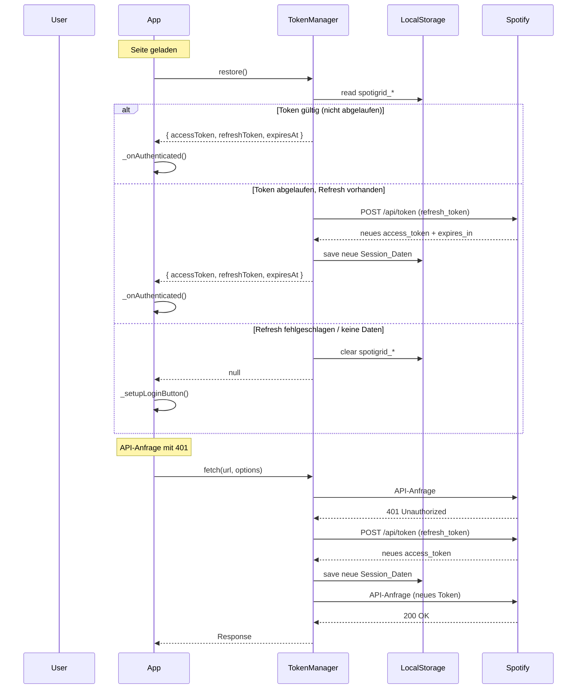
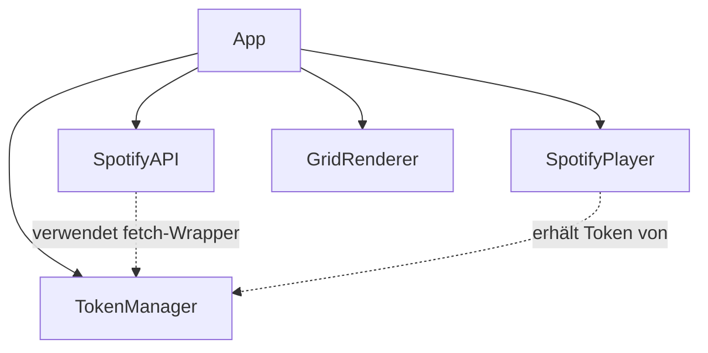
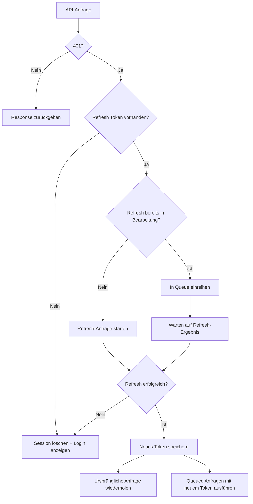

# Design Document: Session Persistence

## Overview

Die Session-Persistenz-Funktion erweitert SpotiGrid um die Fähigkeit, die Spotify-OAuth-Session über Seitenaktualisierungen hinweg aufrechtzuerhalten. Dazu wird ein neues `TokenManager`-Modul eingeführt, das Token-Speicherung (localStorage), automatische Session-Wiederherstellung, transparente Token-Erneuerung bei 401-Antworten und eine Logout-Funktion bereitstellt.

### Kernkonzept

```
┌──────────────────────────────────────────────────────┐
│                       App                            │
│  init() → TokenManager.restore() → _onAuthenticated │
└────────┬─────────────────────────────────────────────┘
         │ delegiert Token-Verwaltung
         ▼
┌──────────────────────────────────────────────────────┐
│                   TokenManager                       │
│  save() | restore() | refresh() | clear() | fetch() │
│  ─────────────────────────────────────────────────── │
│  localStorage (spotigrid_*) ↔ Memory-Fallback       │
└──────────────────────────────────────────────────────┘
```

Der TokenManager kapselt alle Token-Operationen und bietet eine `fetch()`-Wrapper-Methode, die 401-Antworten abfängt, das Token erneuert und die Anfrage wiederholt. Dadurch sind SpotifyAPI und SpotifyPlayer vom Refresh-Mechanismus entkoppelt.

## Architecture



### Modul-Abhängigkeiten



### Design-Entscheidungen

1. **Neues Modul `TokenManager` statt Erweiterung von `App`**: Trennung von Zuständigkeiten – App orchestriert, TokenManager verwaltet Tokens. Das erleichtert das Testen der Token-Logik isoliert.

2. **localStorage statt sessionStorage**: Erfüllt die Anforderung, Sessions über Tab-Schließen hinaus zu erhalten. sessionStorage wird nur weiterhin für den PKCE code_verifier verwendet (kurzlebig, einmalig).

3. **Fetch-Wrapper im TokenManager**: Statt jeden API-Call in SpotifyAPI einzeln zu modifizieren, bietet TokenManager eine `authenticatedFetch()`-Methode, die 401-Handling und Request-Queuing kapselt.

4. **Request-Queue bei laufender Erneuerung**: Wenn ein Refresh läuft, werden parallele Anfragen in einer Promise-Queue gehalten und nach erfolgreichem Refresh mit dem neuen Token ausgeführt. Das verhindert Race Conditions und mehrfache Refresh-Anfragen.

5. **Memory-Fallback**: Wenn localStorage nicht verfügbar ist (z.B. Private Browsing in Safari), werden Tokens nur im Arbeitsspeicher gehalten. Die App funktioniert normal, aber Sessions überleben keinen Page Refresh.

## Components and Interfaces

### TokenManager (`js/token-manager.js`)

```javascript
/**
 * Verwaltet OAuth-Tokens: Speicherung, Wiederherstellung, Erneuerung.
 */
export class TokenManager {
  constructor(options?: { clientId: string; storage?: Storage })

  // --- Öffentliche API ---

  /** Speichert Token-Daten nach erfolgreichem Auth */
  save(tokenData: { access_token: string; refresh_token?: string; expires_in: number }): void

  /** Stellt Session aus localStorage wieder her. Gibt null zurück wenn keine gültige Session. */
  async restore(): Promise<SessionData | null>

  /** Erneuert das Access Token über den Refresh Token */
  async refresh(): Promise<SessionData>

  /** Entfernt alle gespeicherten Session-Daten */
  clear(): void

  /** Gibt das aktuelle Access Token zurück (oder null) */
  getAccessToken(): string | null

  /** Gibt das aktuelle Refresh Token zurück (oder null) */
  getRefreshToken(): string | null

  /** Prüft ob das gespeicherte Token noch gültig ist */
  isTokenValid(): boolean

  /** Fetch-Wrapper mit automatischer 401-Erneuerung und Request-Queuing */
  async authenticatedFetch(url: string, options?: RequestInit): Promise<Response>
}
```

### SessionData (Typ-Definition)

```javascript
/**
 * @typedef {Object} SessionData
 * @property {string} accessToken
 * @property {string|null} refreshToken
 * @property {number} expiresAt - Unix-Timestamp in Millisekunden
 */
```

### Änderungen an bestehenden Modulen

#### `App` (js/app.js)

- **Neues Feld**: `this.tokenManager = new TokenManager({ clientId: CLIENT_ID })`
- **init()**: Vor dem URL-Code-Check zuerst `tokenManager.restore()` aufrufen
- **_onAuthenticated()**: Token vom TokenManager beziehen statt von `this._token`
- **Neues Feld**: Logout-Button-Handler
- **Neue Methode**: `logout()` – ruft `tokenManager.clear()`, stoppt Player, setzt UI zurück

#### `SpotifyAPI` (js/spotify-api.js)

- **Konstruktor**: Nimmt `tokenManager` statt `token` entgegen (oder eine `fetchFn`-Funktion)
- **Alle fetch-Aufrufe**: Verwenden `tokenManager.authenticatedFetch()` statt direktem `fetch()`

#### `SpotifyPlayer` (js/spotify-player.js)

- **getOAuthToken-Callback**: Bezieht Token dynamisch vom TokenManager statt aus fixem `this._token`
- **play()**: Verwendet `tokenManager.authenticatedFetch()` für den Play-Endpunkt

#### `index.html`

- **Neuer Button**: `<button id="logout-button" type="button" hidden>Logout</button>` im Header

## Data Models

### localStorage-Schema

| Schlüssel | Typ | Beschreibung |
|-----------|-----|--------------|
| `spotigrid_access_token` | string | Spotify OAuth Access Token |
| `spotigrid_refresh_token` | string | Spotify OAuth Refresh Token |
| `spotigrid_token_expires_at` | string (Zahl) | Unix-Timestamp in ms, wann das Access Token abläuft |

### TokenManager interner Zustand

```javascript
{
  _accessToken: string | null,      // Im Speicher gehaltenes Access Token
  _refreshToken: string | null,     // Im Speicher gehaltenes Refresh Token
  _expiresAt: number | null,        // Ablaufzeitpunkt (ms since epoch)
  _refreshPromise: Promise | null,  // Laufende Refresh-Anfrage (für Queuing)
  _storage: Storage | null,         // localStorage-Referenz oder null (Fallback)
  _clientId: string                 // Spotify Client ID für Refresh-Requests
}
```

### Token-Erneuerungs-Request

```
POST https://accounts.spotify.com/api/token
Content-Type: application/x-www-form-urlencoded

grant_type=refresh_token
&refresh_token={spotigrid_refresh_token}
&client_id={CLIENT_ID}
```

### Token-Erneuerungs-Response

```json
{
  "access_token": "new_access_token",
  "token_type": "Bearer",
  "expires_in": 3600,
  "refresh_token": "new_refresh_token",  // optional, nicht immer vorhanden
  "scope": "streaming user-read-email user-read-private"
}
```


## Correctness Properties

*A property is a characteristic or behavior that should hold true across all valid executions of a system — essentially, a formal statement about what the system should do. Properties serve as the bridge between human-readable specifications and machine-verifiable correctness guarantees.*

### Property 1: Token save/restore round-trip

*For any* valid token response object containing an access_token (non-empty string), an optional refresh_token, and an expires_in value (positive integer), saving it via `save()` and then calling `restore()` (with time mocked to before expiry) SHALL return a SessionData object where accessToken equals the original access_token, refreshToken equals the original refresh_token (or null if absent), and expiresAt equals the timestamp at save time plus expires_in × 1000.

**Validates: Requirements 1.1, 2.5, 3.2**

### Property 2: Storage location invariant

*For any* token data saved by the TokenManager, the tokens SHALL only be present under `spotigrid_`-prefixed keys in localStorage. After any save operation, sessionStorage SHALL NOT contain any keys with prefix `spotigrid_`, and `document.cookie` SHALL NOT contain the access_token or refresh_token value.

**Validates: Requirements 1.2, 6.1**

### Property 3: Partial token storage

*For any* token response where refresh_token or expires_in is absent (undefined/null), the TokenManager SHALL store only the fields that are present. Specifically: if refresh_token is absent, `localStorage.getItem('spotigrid_refresh_token')` SHALL return null; if expires_in is absent, `localStorage.getItem('spotigrid_token_expires_at')` SHALL return null.

**Validates: Requirements 1.4**

### Property 4: Memory fallback preserves access

*For any* token data, when localStorage.setItem throws an exception, the TokenManager SHALL still hold the token data in memory such that `getAccessToken()` returns the access_token and `getRefreshToken()` returns the refresh_token (if provided).

**Validates: Requirements 1.3, 6.2**

### Property 5: Restore valid token without network request

*For any* stored session where the access_token is a non-empty string and the stored expiresAt is in the future (greater than current time), calling `restore()` SHALL return a SessionData object containing that access_token without making any network requests (fetch not called).

**Validates: Requirements 2.1**

### Property 6: Failed refresh clears all session data

*For any* refresh failure scenario (network error, HTTP 400, HTTP 401, or missing refresh_token), the TokenManager SHALL remove all `spotigrid_`-prefixed keys from localStorage AND set the in-memory accessToken and refreshToken to null.

**Validates: Requirements 2.3, 3.4, 4.1, 4.4**

### Property 7: Authenticated fetch retries exactly once on 401

*For any* URL and request options, when `authenticatedFetch()` receives a 401 response and a refresh_token is available, the TokenManager SHALL make exactly one refresh request to the token endpoint. If the refresh succeeds, the original request SHALL be retried exactly once with the new access_token in the Authorization header.

**Validates: Requirements 3.1, 3.3, 4.3**

### Property 8: Request queuing during refresh

*For any* N concurrent calls to `authenticatedFetch()` that each receive a 401 response while a refresh is in progress, the TokenManager SHALL issue exactly one refresh request (not N). After the refresh succeeds, all N requests SHALL be retried with the same new access_token.

**Validates: Requirements 3.5**

### Property 9: Clear removes all session data

*For any* state of the TokenManager (with any combination of stored access_token, refresh_token, and expires_at in localStorage), calling `clear()` SHALL result in `localStorage.getItem('spotigrid_access_token')` returning null, `localStorage.getItem('spotigrid_refresh_token')` returning null, `localStorage.getItem('spotigrid_token_expires_at')` returning null, and `getAccessToken()` returning null.

**Validates: Requirements 5.2**

### Property 10: Refresh token never exposed in URL or DOM

*For any* operation performed by the TokenManager (save, restore, refresh, authenticatedFetch), the refresh_token value SHALL never appear in `window.location.href`, `window.location.search`, or as textContent/attribute value of any DOM element.

**Validates: Requirements 6.4**

## Error Handling

### Fehlerkategorien

| Fehler | Auslöser | Verhalten |
|--------|----------|-----------|
| localStorage nicht verfügbar | Browser-Einschränkung, Private Mode | Fallback auf Memory-Only, Session funktioniert aber überlebt keinen Refresh |
| localStorage.setItem wirft | Speicher voll (QuotaExceededError) | Selbes Fallback wie oben |
| Refresh Token ungültig | Spotify gibt 400/401 zurück | Session löschen, Login-Button anzeigen, Fehlermeldung |
| Netzwerkfehler bei Refresh | Keine Verbindung | Session löschen, Login-Button anzeigen, Fehlermeldung |
| Refresh Timeout (>10s) | Langsame/instabile Verbindung | AbortController mit 10s Timeout, behandelt wie Netzwerkfehler |
| 401 ohne Refresh Token | Refresh Token nie gespeichert oder bereits entfernt | Session sofort löschen, Login-Button |

### Fehlerbehandlungs-Strategie



### Error-Messages (User-facing)

- **Abgelaufene Session**: "Deine Sitzung ist abgelaufen. Bitte erneut einloggen."
- **Netzwerkfehler bei Refresh**: "Die Verbindung zu Spotify konnte nicht hergestellt werden. Bitte erneut einloggen."
- **Allgemeiner Auth-Fehler**: "Authentifizierung fehlgeschlagen. Bitte erneut einloggen."

## Testing Strategy

### Dual Testing Approach

Die Test-Strategie kombiniert Unit-Tests für konkrete Szenarien mit Property-Based Tests für universelle Korrektheitseigenschaften.

### Property-Based Tests (fast-check)

Jeder Correctness Property wird als eigener PBT-Test implementiert:

- **Library**: `fast-check` (bereits im Projekt vorhanden, v4.1.1)
- **Framework**: `vitest` mit jsdom-Environment
- **Iterationen**: Minimum 100 Runs pro Property
- **Tag-Format**: `Feature: session-persistence, Property {N}: {title}`

**Generatoren**:
- `arbitraryTokenResponse()`: Erzeugt zufällige `{ access_token, refresh_token?, expires_in }` Objekte
- `arbitrarySessionState()`: Erzeugt zufällige localStorage-Zustände mit spotigrid_*-Keys
- `arbitraryUrl()`: Erzeugt gültige API-URLs
- `arbitraryErrorStatus()`: Erzeugt 400/401/Netzwerkfehler-Szenarien

**Mocking-Strategie**:
- `localStorage`: jsdom stellt ein funktionierendes localStorage bereit; für Fehlerfälle wird `setItem` gemockt
- `fetch`: Vitest `vi.fn()` Mock für kontrollierte Responses
- `Date.now`: Gemockt für deterministische Expiry-Berechnungen

### Unit-Tests (Beispielbasiert)

| Test | Validiert |
|------|-----------|
| Restore mit leerem localStorage zeigt Login-Button | Req 2.4 |
| Logout setzt UI-Elemente korrekt zurück | Req 5.3 |
| Logout stoppt aktive Wiedergabe | Req 5.4 |
| Logout-Button sichtbar wenn authentifiziert | Req 5.1 |
| Fehlermeldung bei gescheitertem Refresh | Req 4.2 |
| Logout abgeschlossen innerhalb 1 Sekunde | Req 5.5 |
| Memory-only Mode: Reload zeigt Login-Button | Req 6.3 |

### Test-Dateistruktur

```
tests/
  token-manager.test.js                        # Unit-Tests für TokenManager
  token-save-restore.property.test.js          # Property 1
  token-storage-location.property.test.js      # Property 2
  token-partial-storage.property.test.js       # Property 3
  token-memory-fallback.property.test.js       # Property 4
  token-restore-valid.property.test.js         # Property 5
  token-failed-refresh-clears.property.test.js # Property 6
  token-401-retry.property.test.js             # Property 7
  token-request-queue.property.test.js         # Property 8
  token-clear.property.test.js                 # Property 9
  token-no-exposure.property.test.js           # Property 10
```

### Integration Tests

- Vollständiger Flow: Auth → Save → Reload → Restore → API-Calls → Logout
- TokenManager + SpotifyAPI Zusammenspiel bei 401-Handling
- Player-Reconnect nach Token-Refresh (Token im getOAuthToken-Callback aktualisiert)
