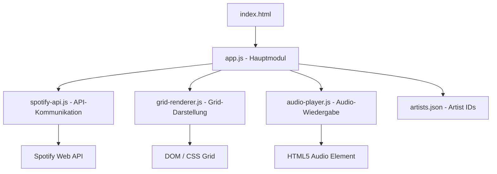
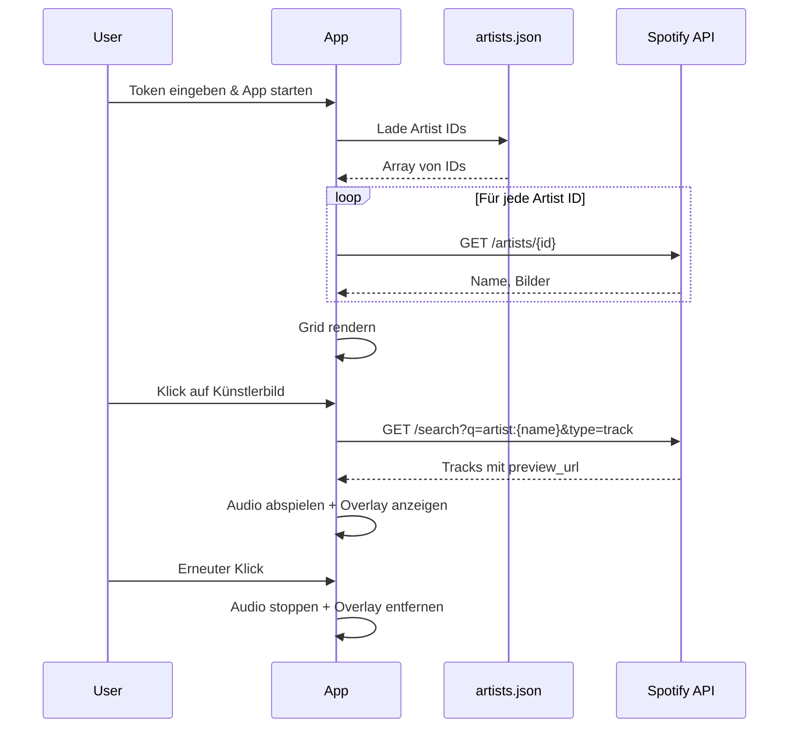
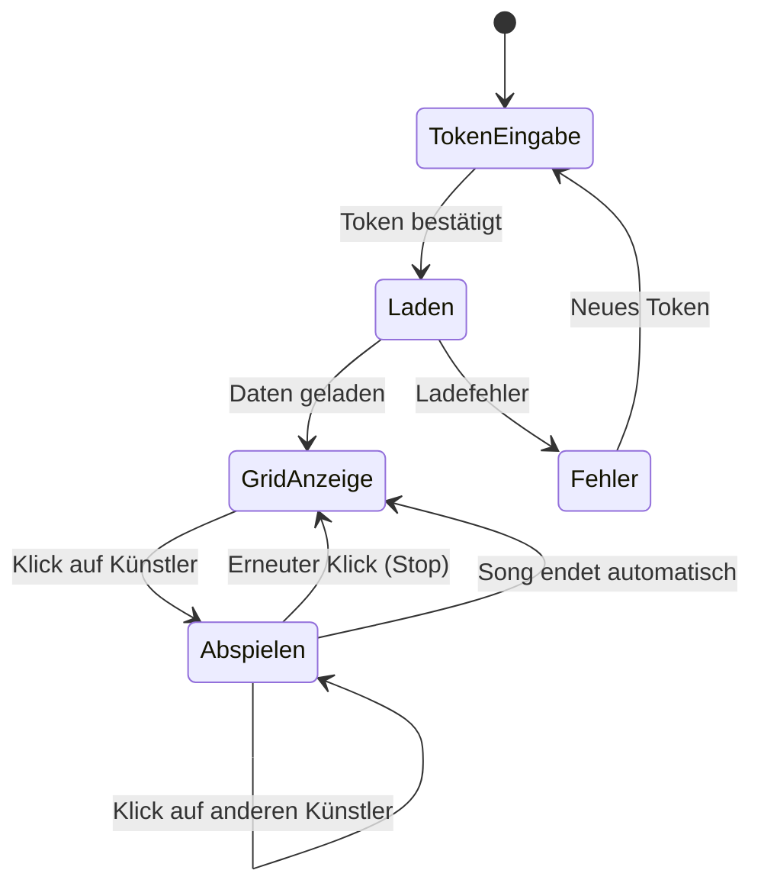

# Design Document

## Overview

Dieses Dokument beschreibt die technische Architektur der SpotiGrid-Anwendung – einer clientseitigen Single Page Application (SPA), die auf GitHub Pages gehostet wird. Die App lädt Spotify Artist IDs aus einer JSON-Datei, ruft über die Spotify Web API Künstlerdaten (Bilder, Namen) ab und zeigt diese in einem 4-Spalten-Grid an. Durch Klick auf ein Künstlerbild wird ein 30-Sekunden-Vorschau-Track abgespielt.

### Wichtige Design-Entscheidungen

1. **Kein Build-System**: Die App verwendet ausschließlich Vanilla HTML, CSS und JavaScript – kein Bundler, kein Framework. Dies vereinfacht das Deployment auf GitHub Pages.

2. **Token-Eingabe durch den Benutzer**: Da der Client Credentials Flow `client_secret` erfordert (das nicht im Frontend exponiert werden darf), wird das Access Token vom Benutzer manuell bereitgestellt (z.B. über die Spotify Developer Console generiert). Die App bietet ein Eingabefeld für das Token.

3. **Search API statt Top-Tracks**: Der Endpoint `GET /artists/{id}/top-tracks` wurde im Februar 2026 für Developer-Mode-Apps entfernt ([Spotify Web API Changelog](https://developer.spotify.com/documentation/web-api/references/changes/february-2026)). Als Alternative wird `GET /search?q=artist:{name}&type=track` verwendet, um Tracks mit `preview_url` zu finden.

4. **Einzelabfragen statt Batch**: Der Batch-Endpoint `GET /artists` wurde ebenfalls entfernt. Jeder Künstler wird über `GET /artists/{id}` einzeln abgefragt. Zur Optimierung werden Requests parallelisiert (mit Rate-Limit-Berücksichtigung).

5. **Audio-Wiedergabe über HTML5 Audio API**: Ein einzelnes `<audio>`-Element wird wiederverwendet, um jeweils einen Track abzuspielen.

## Architecture

Die Anwendung folgt einer einfachen modularen Architektur ohne externe Abhängigkeiten:



### Datenfluss



### Datei-Struktur

```
SpotiGrid/
├── index.html          # Haupt-HTML mit Token-Eingabe und Grid-Container
├── style.css           # CSS Grid Layout und Overlay-Styles
├── js/
│   ├── app.js          # Initialisierung und Orchestrierung
│   ├── spotify-api.js  # Spotify API Kommunikation
│   ├── grid-renderer.js # Grid-Rendering und DOM-Manipulation
│   └── audio-player.js # Audio-Wiedergabe-Steuerung
└── artists.json        # JSON-Array mit Spotify Artist IDs
```

## Components and Interfaces

### 1. SpotifyAPI (spotify-api.js)

Zuständig für die gesamte Kommunikation mit der Spotify Web API.

```javascript
/**
 * @param {string} token - Spotify API Access Token
 */
class SpotifyAPI {
  constructor(token) { }

  /**
   * Ruft Künstlerdaten für eine einzelne ID ab.
   * @param {string} artistId - Spotify Artist ID
   * @returns {Promise<{id: string, name: string, imageUrl: string|null}>}
   * @throws {Error} bei Netzwerk- oder Auth-Fehlern
   */
  async getArtist(artistId) { }

  /**
   * Ruft Künstlerdaten für mehrere IDs parallel ab (mit Rate-Limiting).
   * @param {string[]} artistIds - Array von Spotify Artist IDs
   * @returns {Promise<Array<{id: string, name: string, imageUrl: string|null}>>}
   */
  async getArtists(artistIds) { }

  /**
   * Sucht einen Track mit preview_url für einen Künstler.
   * @param {string} artistName - Name des Künstlers
   * @returns {Promise<{previewUrl: string, trackName: string}|null>}
   */
  async findPreviewTrack(artistName) { }
}
```

### 2. GridRenderer (grid-renderer.js)

Verantwortlich für die Darstellung der Künstlerbilder im Grid.

```javascript
class GridRenderer {
  /**
   * @param {HTMLElement} container - Das Grid-Container-Element
   */
  constructor(container) { }

  /**
   * Rendert alle Künstler als Grid-Elemente.
   * @param {Array<{id: string, name: string, imageUrl: string|null, hasPreview: boolean}>} artists
   */
  render(artists) { }

  /**
   * Zeigt das Overlay für einen bestimmten Künstler an.
   * @param {string} artistId - ID des Künstlers
   * @param {string} artistName - Name für die Anzeige im Overlay
   */
  showOverlay(artistId, artistName) { }

  /**
   * Entfernt das Overlay von einem Künstler.
   * @param {string} artistId - ID des Künstlers
   */
  hideOverlay(artistId) { }

  /**
   * Markiert Künstler ohne Vorschau visuell.
   * @param {string} artistId
   */
  markNoPreview(artistId) { }
}
```

### 3. AudioPlayer (audio-player.js)

Steuert die Wiedergabe von Audio-Vorschauen.

```javascript
class AudioPlayer {
  constructor() { }

  /**
   * Spielt eine Vorschau-URL ab.
   * @param {string} previewUrl - URL der 30-Sekunden-Vorschau
   * @param {function} onEnded - Callback wenn die Wiedergabe endet
   */
  play(previewUrl, onEnded) { }

  /**
   * Stoppt die aktuelle Wiedergabe.
   */
  stop() { }

  /**
   * Gibt zurück, ob gerade abgespielt wird.
   * @returns {boolean}
   */
  isPlaying() { }

  /**
   * Gibt die aktuell abgespielte URL zurück.
   * @returns {string|null}
   */
  getCurrentUrl() { }
}
```

### 4. App (app.js)

Orchestriert alle Module und verwaltet den App-Zustand.

```javascript
class App {
  /**
   * Initialisiert die App.
   * @param {Object} config
   * @param {string} config.artistsJsonPath - Pfad zur artists.json
   * @param {string} config.gridContainerId - ID des Grid-Containers
   * @param {string} config.tokenInputId - ID des Token-Eingabefelds
   */
  constructor(config) { }

  /**
   * Startet die App: Lädt IDs, holt Daten, rendert Grid.
   */
  async start() { }

  /**
   * Behandelt Klick auf ein Künstlerbild.
   * @param {string} artistId
   */
  async handleArtistClick(artistId) { }

  /**
   * Zeigt eine Fehlermeldung im UI an.
   * @param {string} message
   */
  showError(message) { }
}
```

### Interaktions-Schema



## Data Models

### Artist (intern)

```typescript
interface Artist {
  id: string;            // Spotify Artist ID
  name: string;          // Künstlername
  imageUrl: string|null; // URL des höchstauflösenden Bildes (oder null)
  previewUrl: string|null; // URL der Track-Vorschau (lazy loaded)
  trackName: string|null;  // Name des Vorschau-Tracks
  hasPreview: boolean;   // Ob eine Vorschau verfügbar ist (initial: unknown → true/false)
}
```

### ArtistConfig (artists.json)

```json
[
  "0TnOYISbd1XYRBk9myaseg",
  "6eUKZXaKkcviH0Ku9w2n3V",
  "..."
]
```

Validierungsregeln:
- Muss valides JSON sein
- Muss ein Array sein
- Jeder Eintrag muss ein nicht-leerer String sein
- Mindestens 20, maximal 40 Einträge

### AppState (Laufzeit)

```typescript
interface AppState {
  token: string|null;               // Aktuelles Spotify API Token
  artists: Artist[];                // Geladene Künstlerdaten
  currentlyPlaying: string|null;    // Artist ID des aktuell abgespielten Künstlers
  isLoading: boolean;               // Ob Daten geladen werden
  error: string|null;               // Aktuelle Fehlermeldung
}
```

### Spotify API Responses (relevant)

**GET /artists/{id}** Response (vereinfacht):
```json
{
  "id": "string",
  "name": "string",
  "images": [
    { "url": "string", "height": 640, "width": 640 },
    { "url": "string", "height": 300, "width": 300 },
    { "url": "string", "height": 64, "width": 64 }
  ]
}
```

**GET /search?q=artist:{name}&type=track** Response (vereinfacht):
```json
{
  "tracks": {
    "items": [
      {
        "name": "string",
        "preview_url": "string|null",
        "artists": [{ "id": "string", "name": "string" }]
      }
    ]
  }
}
```

## Correctness Properties

*Eine Property ist eine Eigenschaft oder ein Verhalten, das für alle gültigen Ausführungen eines Systems gelten sollte – im Wesentlichen eine formale Aussage darüber, was das System tun soll. Properties bilden die Brücke zwischen menschenlesbaren Spezifikationen und maschinenverifizierbaren Korrektheitsgarantien.*

### Property 1: JSON-Validierung lehnt invalide Eingaben ab

*Für jedes* JSON-Dokument, das kein Array aus nicht-leeren Strings mit einer Länge zwischen 20 und 40 ist, soll die Validierungsfunktion eine entsprechende Fehlermeldung zurückgeben und das Dokument ablehnen.

**Validates: Requirements 1.2, 1.3, 1.4**

### Property 2: JSON-Validierung akzeptiert valide Eingaben

*Für jedes* JSON-Array bestehend aus 20 bis 40 nicht-leeren Strings soll die Validierungsfunktion das Array erfolgreich akzeptieren und unverändert zurückgeben.

**Validates: Requirements 1.1**

### Property 3: Höchstauflösendes Bild wird ausgewählt

*Für jedes* nicht-leere Array von Bildobjekten mit unterschiedlichen Breiten soll die Bildauswahlfunktion das Bild mit der größten Breite zurückgeben.

**Validates: Requirements 2.3**

### Property 4: Nur ein Song gleichzeitig

*Für jede* Sequenz von Klick-Aktionen auf verschiedene Künstlerbilder soll zu jedem Zeitpunkt höchstens ein Audio-Element aktiv sein (isPlaying === true) und höchstens ein Overlay angezeigt werden.

**Validates: Requirements 4.4, 5.1**

### Property 5: Stop-Toggle-Verhalten

*Für jeden* Künstler, dessen Song gerade abgespielt wird, soll ein erneuter Klick auf denselben Künstler die Wiedergabe stoppen und das Overlay entfernen, sodass der Zustand dem Ausgangszustand (kein Song, kein Overlay) entspricht.

**Validates: Requirements 5.1, 5.2**

### Property 6: Overlay-Konsistenz

*Für jeden* App-Zustand gilt: Wenn `currentlyPlaying` eine Artist ID enthält, dann muss genau ein Overlay für diesen Künstler sichtbar sein. Wenn `currentlyPlaying` null ist, darf kein Overlay sichtbar sein.

**Validates: Requirements 4.2, 4.3, 5.2**

## Error Handling

### Fehler-Kategorien

| Fehler | Ursache | Benutzer-Meldung | Verhalten |
|--------|---------|------------------|-----------|
| JSON nicht ladbar | Datei nicht gefunden, Netzwerk | „Die Künstlerdatei konnte nicht geladen werden." | App stoppt, zeigt Fehler |
| JSON ungültig | Kein Array, leere Strings, falsches Format | „Die Datei muss ein JSON-Array mit Spotify Artist ID Strings enthalten." | App stoppt, zeigt Fehler |
| Anzahl ungültig | < 20 oder > 40 IDs | „Die Datei muss zwischen 20 und 40 Artist IDs enthalten." | App stoppt, zeigt Fehler |
| Auth-Fehler | Token ungültig/abgelaufen (401) | „Das Spotify Token ist ungültig oder abgelaufen. Bitte ein neues Token eingeben." | App zeigt Token-Eingabe erneut |
| API-Timeout | Keine Antwort in 10s | „Die Spotify API ist nicht erreichbar. Bitte Internetverbindung prüfen." | App stoppt, bietet Retry |
| Einzelner Artist fehlerhaft | 404 für eine ID | Kein Fehler – Artist wird übersprungen | Grid zeigt übrige Künstler |
| Kein Bild vorhanden | images-Array leer | Platzhalter wird angezeigt | Künstlername unter Platzhalter |
| Keine Vorschau verfügbar | preview_url null für alle Tracks | Bild wird ausgegraut + Icon | Klick hat keine Wirkung |
| Audio-Ladefehler | preview_url nicht abspielbar | Stille Behandlung, Overlay wird nicht gezeigt | Kein Crash |

### Fehler-Anzeige

Fehler werden in einem dedizierten `<div id="error-container">` oberhalb des Grids angezeigt. Kritische Fehler (JSON, Auth, Netzwerk) blockieren die Grid-Anzeige. Einzelne Artist-Fehler werden still behandelt.

## Testing Strategy

### Unit Tests (mit Beispielen)

- **JSON-Validierung**: Korrekte Ablehnung bei leeren Arrays, zu vielen/wenigen Einträgen, nicht-String-Einträgen, leerem String
- **Bildauswahl**: Korrekte Auswahl bei verschiedenen Bild-Arrays (leer, ein Bild, mehrere Bilder)
- **Overlay-Toggle**: Korrekte Anzeige/Entfernung bei Klick-Sequenzen
- **Fehlerbehandlung**: Korrekte Meldungen für verschiedene HTTP-Statuscodes

### Property-Based Tests (mit fast-check)

Die App verwendet [fast-check](https://github.com/dubzzz/fast-check) als Property-Based-Testing-Bibliothek.

- Jeder Property-Test führt mindestens **100 Iterationen** aus
- Jeder Test referenziert seine Design-Property im Format: **Feature: spotify-artist-grid, Property {number}: {text}**
- Properties testen die reine Logik-Schicht (Validierung, Bildauswahl, Zustandsübergänge)

**Property-Tests:**
1. JSON-Validierung – invalide Eingaben → Ablehnung
2. JSON-Validierung – valide Eingaben → Akzeptanz
3. Bildauswahl – höchste Auflösung wird gewählt
4. Audio-Zustand – maximal ein aktiver Player
5. Stop-Toggle – erneuter Klick setzt Zustand zurück
6. Overlay-Konsistenz – Overlay ↔ currentlyPlaying Synchronität

### Integrationstests

- End-to-End-Flow: Token → JSON laden → API Mocks → Grid rendern → Klick → Audio
- Fehlerszenarien: Netzwerkfehler, ungültiges Token, fehlende Dateien

### Testausführung

```bash
npx vitest --run
```

Die Tests nutzen `jsdom` als Umgebung für DOM-Tests und Mocks für `fetch` und `Audio`.
